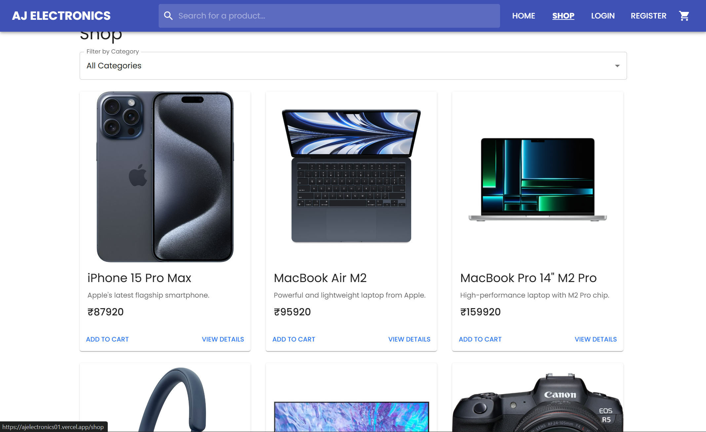
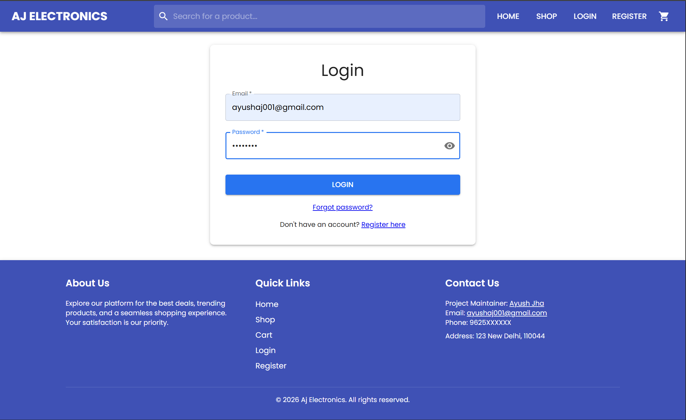

### Live page: https://ajelectronics01.vercel.app/

### Please wait for a minute for the first time while loading the webpage because the website is hosted on free backened that takes time to load.

A complete full-stack e-commerce platform built with modern web technologies, featuring authentication, product browsing, search, cart management, and checkout flow.

This project focuses on real-world shopping experience, backend integration, and clean UI design.

## Features

### User Authentication (Register & Login)

 Homepage with Featured Products

 Product Search

Shop Page with Product Listings

Product Details Page

 Shopping Cart with Total Calculation

 Remove Items from Cart

 Checkout Flow (UI ready)

 Responsive UI

 Deployed Frontend

## Screenshots
### Home Page

Shows featured products and hero section.

### Shop / Explore Products

Browse all available products.

### Search Functionality

Search products instantly.

### Login Page

### Register Page

### Shopping Cart

View selected items and total price.

## Tech Stack

### Frontend

React

CSS / Tailwind

Axios

React Router

Backend

Node.js

Express.js

MongoDB

JWT Authentication

Deployment

Vercel (Frontend)

Backend hosted separately

## Project Highlights

RESTful API architecture

Secure authentication with JWT

Centralized cart state management

Clean component structure

Real-world UI flow

Modular backend routes

## What I Learned

Building authentication systems

Managing cart state across pages

Backend–frontend integration

API design

MongoDB schema modeling

Deploying full-stack apps

Structuring production-ready projects

## Future Improvements

Payment Gateway Integration (Stripe / Razorpay)

Admin Dashboard

Order History

Wishlist Feature

Product Reviews

Stock Management

Pagination & Filters
